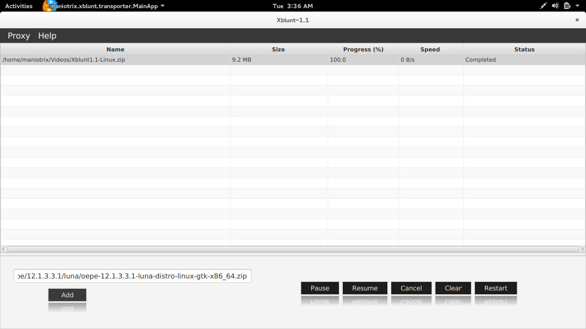
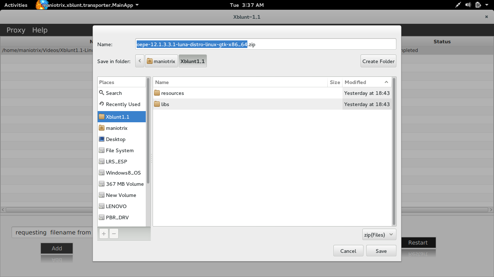
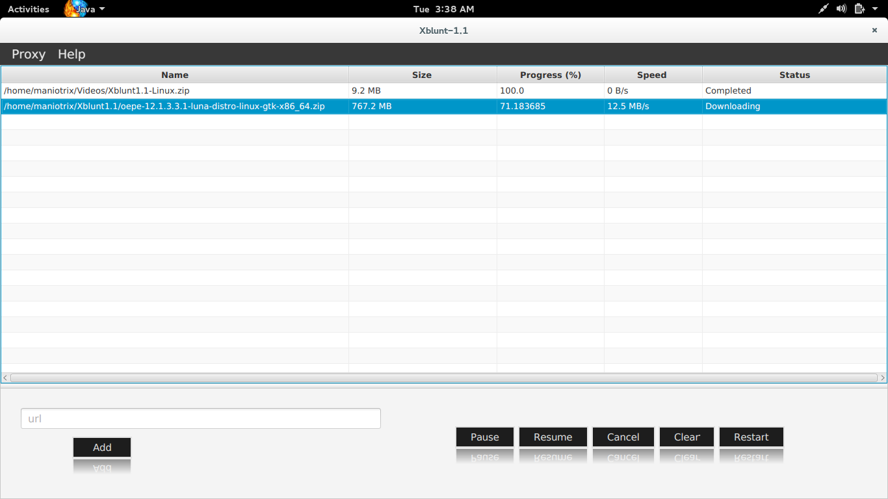

# Xblunt

####  Developed by [maniotrix](https://github.com/maniotrix/xblunt/maniotrix)
 
 ************************
 
## XBlunt-1.1[beta] built with [[JDK-8u25](http://www.oracle.com/technetwork/java/javase/overview/index.html) and [e(fx)clipse](http://www.eclipse.org/efxclipse/index.html)] 

### `Download` [Xblunt-1.1](https://github.com/maniotrix/xblunt/releases)

* `A fast download manager built using powerful and latest Java 8 features.`


## Java Technologies used


##### ` Threads,Networks,Java NIO,Javafx `

## Open Source Frameworks Used

* [controlsfx](http://fxexperience.com/controlsfx/)
* [eclipselink](http://www.eclipse.org/eclipselink)
* [apache-commons-IO](http://commons.apache.org/)

************************

## User Guide

### Paste a download link and click ```Add``` button.



### Wait for Filechooser to appear
###### `` change directory as you wish ``



### Download Started!




